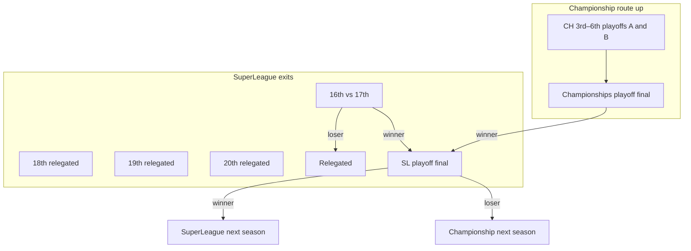

# GPSL Competition Specification

Authoritative design notes from league owner (2026). Implementation should follow this document unless superseded.

## Pyramid (60 clubs)

| Tier | Name | Teams | League games |
|------|------|-------|----------------|
| 1 | **SuperLeague** | 20 | 38 (double round-robin) |
| 2 | **Championship A** | 20 | 38 |
| 2 | **Championship B** | 20 | 38 |

**Total:** 60 clubs.

At **season start** (or end — confirm operational preference), all Championship clubs are **randomly assigned** to Championship A or Championship B (not fixed year-to-year).

---

## League points

- Win **3**, draw **1**, loss **0**.
- Tables must show zones and columns:
  - **Direct promotion** spots
  - **Playoff** spots
  - **Prestige qualification** spots (Super8 / Plate / Shield / Spoon — see below)
  - MP, W, D, L, GF, GA, GD, Pts
  - **Form (last 10)** — by **fixture order** (scheduled matchday order), not submission order

---

## Direct promotion & relegation

| Movement | Rule |
|----------|------|
| **Promoted to SuperLeague (direct)** | Top **2** from Championship A + top **2** from Championship B |
| **Relegated from SuperLeague (direct)** | Bottom **3** — places **18, 19, 20** (definite, no further playoff) |
| **Relegated from SuperLeague (playoff loser)** | **Loser** of SuperLeague **16th vs 17th** playoff match |

**Net movement:** 4 clubs leave SuperLeague (3 direct + 1 playoff loser), balanced by 4 direct promotions from the Championships.

| SuperLeague place | End-of-season outcome |
|-------------------|------------------------|
| 1–15 | Remain in SuperLeague (subject to cup runs) |
| **16 vs 17** | One match — **winner** → SuperLeague playoff final; **loser** → **relegated** |
| **18, 19, 20** | **Relegated** to Championship (A or B via season draw) |

---

## Playoffs (league)

### SuperLeague: 16th vs 17th

- **16th** vs **17th** in SuperLeague → single **relegation/promotion playoff** match.
- **Loser** → relegated to Championship immediately.
- **Winner** → **SuperLeague playoff final** vs winner of **Championships playoff final**.

### SuperLeague playoff final

- **Winner of SL 16v17** vs **winner of Championships playoff final**.
- **Winner** → SuperLeague next season.
- **Loser** → Championship (A or B per season draw).

### Championship playoffs (places 3–6 in each division)

Per division (A and B), same bracket:

| Semi-final 1 | Semi-final 2 |
|--------------|--------------|
| 3rd vs 6th | 4th vs 5th |

- Winners → **division playoff final** (Championship A final / Championship B final).
- Winners of division finals → **Championships playoff final** (A winner vs B winner).
- **Winner** of Championships playoff final → **SuperLeague playoff final** (vs winner of SL 16v17).
- All other playoff losers remain in Championship tier (division per draw).

### End-of-season flow (diagram)

---

## Prestige cups (cup competitions)

Qualification from **final league positions** that season:

| Competition | SuperLeague | Championship (each of A & B) |
|-------------|-------------|-------------------------------|
| **Super8** | Places **1–8** | — |
| **Plate** | Places **9–16** | Places **1–4** |
| **Shield** | — | Places **5–15** + **winners** of 16th vs 17th playoff |
| **Spoon** | — | Places **18–20** + **losers** of 16th vs 17th playoff |

### Championship 16th vs 17th (Prestige)

- **16th** vs **17th** in each Championship division.
- **Winner** → qualifies for **Shield** (in addition to places 5–15).
- **Loser** → **Spoon** (with places 18–20 in that division).

*Note: This 16v17 match is the **Championship** Shield/Spoon playoff — separate from the **SuperLeague** 16v17 relegation playoff.*

### Admin (`admin.html`)

- Prize money for **appearance** and progression: quarters, semis, final (per competition).
- **Instant payout** when round is complete (Prestige cups + League cup).
- **League** prize money: paid **end of season** only.

---

## League cup

- All **60** clubs enter random draw.
- **4** clubs receive a **bye** (admin/configurable).
- Prize money per round — admin controlled, **instant payout** on progression.

---

## Fixtures & calendar

### Generator (`admin.html`)

- Random fixture generator **per season, per division**.
- **Dropdown per position** in each division (manual override / slot assignment).

### Match volume (38 league games)

| GPSL month | Real-world | Matches in month |
|------------|------------|------------------|
| August | Week 1 | **3** |
| September–April | 8 weeks | **4** each |
| May | Week 10 | **3** |

**Total:** 3 + 8×4 + 3 = **38**.

- **One GPSL month = one real-world week.**
- **Weather** for each fixture derived from **GPSL month** (gameplay TBD).

### Cup fixtures

- Separate draws / brackets; not mixed into league generator.

---

## Matchday (owners)

Flow (target UX):

1. **Dashboard → Match Day** — dropdown of **upcoming fixtures** for owner’s club.
2. **Pre-match:** pitch UI — formation, pick players in positions → **match squad** locked for that fixture.
3. **Post-match:** confirm:
   - Who played, goals, assists, **player of the match**, **ratings** per player
   - **Score**
4. Submission → **inbox notification** to opposition → **confirm** or **reject**.
5. On mutual confirm (or admin) → result official → update table, stats, gate receipts.

### Player database / stats

Persist per player:

- Match ratings, **season average**, **all-time** average
- Goals, assists, appearances (league + cups)
- Leaderboards: league top scorer, cup top scorers, assists, etc.

---

## Gate receipts

| Match type | Split |
|------------|--------|
| **Home league** | **100%** home club |
| **Cup** (incl. prestige + league cup) | **50% / 50%** home and away |

Formula inputs (to detail in finance spec):

- Stadium **capacity** (`Clubs.Capacity`)
- **Current league position**
- **Last 5 seasons** history
- (Exact formula TBD in SQL — see Phase 4)

---

## Pages & admin (target)

| Page | Purpose |
|------|---------|
| `fixtures.html` | View fixtures by division / matchday |
| `matchday.html` | Squad selection, result entry, confirmations |
| `progress.html` | Tables, zones, prestige qualification preview, Europe-style labels |
| `stadium.html` | Capacity, gate income context |
| `finances.html` | Balance, ledger (gates, prizes, transfers) |
| `history.html` | Season archives, 5-year record |
| `admin.html` | Fixture gen, cup draws, prize money, season end, playoffs |

---

## Implementation phases (suggested)

1. **Phase 0 — Schema & season** — divisions, `club_seasons`, `seasons`, 60-club registration, championship A/B draw.
2. **Phase 1 — Fixtures** — 38-match calendar, weather month, admin generator + position dropdown.
3. **Phase 2 — Standings & zones** — points table with promotion/playoff/prestige columns + form (last 10 by fixture order).
4. **Phase 3 — Matchday v1** — score submit + inbox confirm/reject (no formation UI yet).
5. **Phase 4 — Player stats** — G/A/apps, ratings, leaderboards.
6. **Phase 5 — Gate receipts & finances ledger** — league home 100%, cup 50/50.
7. **Phase 6 — Prestige cups + League cup** — draws, brackets, admin prize instant payout.
8. **Phase 7 — Playoffs & end of season** — bracket engine, promotion/relegation, SL playoff final.
9. **Phase 8 — Matchday v2** — formation / pitch / pre-match squad.

---

## Table zone labels (for `progress.html`)

### SuperLeague (20 teams)

| Places | Zone |
|--------|------|
| 1–8 | Super8 |
| 9–16 | Plate |
| 16–17 | **League playoff** (16v17 — winner → SL playoff final; loser relegated) |
| 18–20 | **Direct relegation** |
| — | Top 2 in each Championship (not on SL table) = direct promotion |

### Championship (each division, 20 teams)

| Places | Zone |
|--------|------|
| 1–2 | Direct promotion to SuperLeague |
| 3–6 | Championship playoffs |
| 1–4 | Plate |
| 5–15 | Shield |
| 16–17 | Shield/Spoon playoff |
| 18–20 | Spoon |

---

## Open clarifications (later)

1. **Championship draw timing:** Start of season only, or re-draw when clubs are promoted/relegated?
2. **Result reject:** Deadline / admin override if opposition never confirms?
3. **SL place 15:** Confirm no playoff involvement (between Plate zone and 16v17 playoff).

---

## Related repo state (today)

- Transfer market, draft, special auctions: **live**.
- **Phase 0 competition:** `competition_phase0.sql` + `progress.html` + admin season UI.
- **Phase 1 fixtures:** `competition_phase1_fixtures.sql` + `fixtures.html` + admin generator.
- **Phase 2 standings:** `competition_phase2_standings.sql` + `progress.html` (zones, form).
- **Phase 3 matchday:** `competition_phase3_matchday.sql` + `matchday.html` (submit / confirm / reject).
- Gates, cups: **later phases**.
- `rollover_season` RPC: exists in Supabase for **player/transfer** rollover; separate from competition season activate.
- `Clubs.Stadium`, `Clubs.Capacity`: exist; gate logic **not** implemented.
