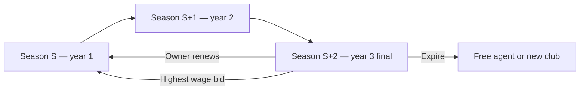

# GPSL Player contracts — specification (draft)

Authoritative design from league owner (2026). Align with legacy spreadsheet when reviewing.

**Status:** **Phase 1–2 (C1 + C2/C3 partial)** — signing hooks, same-season lock, final-year sell block, admin contract tick on rollover, Squad renew/expire. **Not implemented:** expiring-contract market + hidden wage bids (C4–C5). Uses **`competition_seasons.label`** for `Season_Signed`.

---

## Summary

| Topic | Rule |
|--------|------|
| **Length** | **3 GPSL seasons** per signing |
| **Decision window** | After **2 seasons played** (start of **final contract year**) |
| **Selling** | Allowed only while **2+ seasons remain** — **cannot sell** in final year |
| **Final year (1 left)** | Player **automatically** on expiring-contract / FA list — no transfer list |
| **Owner choices (final year, standard)** | Renew (≥ wage) · Expire (MV) · hidden wage bids — **no sell** |
| **Renew wage (standard)** | New offer must be **≥ current contract wage** |
| **Home-grown** | `Players.Nation` = `Clubs.Nation` — **at least 8** (no maximum) |
| **Under-21** | Age **≤ 21** — **at least 5** (no maximum) |
| **Squad size** | **Max 28** players |
| **Home-grown ≤23** | Same sell rules; **uncontested renewal** (current wage or MV) |
| **Expiry auction** | **Standard players only** — one hidden bid per club; highest wins |
| **Winner wage** | Winning bid becomes player’s **contract wage** at new club (or stay) |
| **Free agent again** | Wage reverts to **standard calculated wage** (formula TBD from spreadsheet) |

---

## Contract lifecycle (timeline)

Assume player signs at start of **season S** (GPSL/transfer season counter, not necessarily `competition_seasons.id`).



| Phase | Seasons left | Owner | Other clubs |
|--------|----------------|--------|-------------|
| Years 1–2 | 3 → 2 | Normal squad; **may sell** on transfer market (window rules) | — |
| **Final year** | **1** | **Auto-listed** on expiring-contract market; **no selling**; renew **or** expire | **One hidden wage bid** each (incl. current club) |
| Resolution | 0 | Renew → new 3-year deal; or expire → **MV** credit + FA | Highest wage bid wins player at bid wage |

**Home-grown ≤23** (see below): same sell/no-sell rules; at renewal use **uncontested** path if still ≤23; from age **24** use **full** expiry rules on the next contract cycle that ends.

**Open with spreadsheet:** whether “3 seasons” means three full rollovers after signing season, or signing season counts as year 1 inclusive (spec above uses **inclusive: years at S, S+1, S+2**).

---

## Home-grown players (age ≤ 23) — uncontested renewal

**Home-grown** and **23 or younger** (re-checked each rollover) are **exempt from the contested expiry market**:

| They skip | They still get |
|-----------|----------------|
| Automatic listing on expiring-contract / FA bid market | **Uncontested renewal** decision (owner only) |
| Hidden wage bids from **other** clubs | Choice: **renew** or **release for market value** |
| Competing against external highest wage | No other club can poach via expiry auction |

### Owner options (home-grown, uncontested)

When **1 season remains** on the contract **and** the player is still **home-grown and age ≤ 23** at that rollover/decision point:

1. **Renew** — new **3-season** deal at the **same wage they are on now** (no other clubs involved; owner is not forced to pay more to keep them).
2. **Release** — player leaves; club receives **market value**; player becomes free agent with **standard calculated wage** (`market_value × division %`).

No third-party wage bids. Current owner does not need to outbid anyone to keep the player.

### Same sell rules as everyone else

**Confirmed:** home-grown ≤23 **cannot sell** in the final contract year either — same as standard players (sell only with **2+ seasons** left).

### When they turn 24

**Confirmed:** HG protection **ends at 24**. On the **next 3-season contract cycle that reaches its end**, normal rules apply:

- Auto-listed on expiring-contract market (if standard path applies)
- Hidden wage bids from other clubs
- Renew must be **at least** current wage (and owner may need to win the auction — see standard rules)

If they are **still ≤23** when that contract’s final year starts, uncontested renewal still applies for **that** expiry.

**Implementation:**

```text
is_homegrown(player, club) :=
  Players.Nation = Clubs.Nation

is_homegrown_u23(player, club) :=
  is_homegrown(player, club) AND player.age <= 23

expiry_auction_applies(player) :=
  contract_rules_apply(player) AND NOT is_homegrown_u23(player)

homegrown_renewal_applies(player) :=
  is_homegrown_u23(player) AND seasons_remaining = 1

-- Age re-checked each rollover; age >= 24 at decision => full expiry_auction_applies
```

**Home-grown definition (confirmed):**

```text
homegrown(player, club) :=
  normalize(Players.Nation) = normalize(Clubs.Nation)
```

- Club nation: `Clubs.Nation`
- Player nation: `Players.Nation`
- SQL: `is_player_homegrown(player_id, club_short)`
- JS: `squad_rules.js` → `isHomeGrownPlayer()`

HG contract protection (≤23): `is_homegrown AND age <= 23` at renewal rollover.

---

## Squad composition rules (28-man squad)

| Rule | Minimum |
|------|---------|
| **Home-grown** | **Minimum 8** (Nation matches `Clubs.Nation`; no maximum) |
| **Under-21** | **Minimum 5** (player `Age` **≤ 21**; no maximum) |
| **Squad size** | **Maximum 28** registered players |

- Compliance check: `check_club_squad_composition(club_short)` (SQL) / `analyseSquadComposition()` (JS).
- UI: **Squad** page shows counts and warnings (informational until registration enforced in transfers).

**Not yet enforced:** transfer/draft signing may still allow non-compliant squads until hooks added.

---

## Selling vs final year

| Seasons remaining | Transfer list / sell |
|-------------------|----------------------|
| **3 or 2** | **Allowed** (existing transfer window & listings) |
| **1** | **Blocked** — owner cannot list or sell; player is **automatically** on the expiring-contract market |

So a club that wanted to cash out must do it **before** the last contract season starts.

---

## Owner options (final contract year only — standard players)

Applies when `expiry_auction_applies` is true and **1 season remains** (not home-grown ≤23).

### 1. Renew contract

- Owner offers a **new 3-season contract** (often via winning their own hidden bid if others bid too).
- **Wage offered must not be lower than today** — owner can keep them on the same wage or **pay more**; cannot renew on a pay cut.
- Contract resets to **3 seasons remaining** at the chosen wage.

### 2. Allow contract to expire

- Player becomes **free agent** (`Contracted_Team` null).
- **Current club** receives **market value** (`Players.market_value`) as a one-off credit (`Club_Finances` / ledger — confirm with spreadsheet).
- Player wage resets to **standard calculated wage** for FA.

### 3. Sell — not available

- **No** transfer listing, direct sale, or outgoing transfer in the final contract season.
- Dispute resolution: engine must **reject** `Player_Transfer_Listings` and seller-initiated moves when `seasons_remaining = 1`.

---

## Hidden wage bids (1 season remaining)

At **1 season left**, **standard** players are **automatically** on the **expiring-contracts market** (no owner action required). **Home-grown ≤23 are not listed there.** Visibility: GPDB + dedicated page (TBD).

| Rule | Detail |
|------|--------|
| **Who can bid** | Any owner (including **current** club) |
| **Bids per club** | **One** wage offer per player per expiry cycle |
| **Visibility** | **Hidden** — other owners do not see competing amounts |
| **Timing** | For contract **expiry** (end of final season), not immediate transfer |
| **Winner** | **Highest wage** at resolution |
| **Current club wins tie?** | **→ confirm** (same amount: prefer current club vs earliest bid vs random) |
| **Outcome** | Winner’s club gets player on **new 3-season contract** at **bid wage** |

If **current owner** wins: player **stays**, wage updates to winning (their) bid, contract **renews** (3 seasons).

If **other owner** wins: player moves at expiry (or immediately? **→ confirm**) with bid wage.

---

## Wage model

| State | Wage source |
|--------|-------------|
| Under contract | **Stored contract wage** (`player_contracts.wage`) — may start from calculated wage at signing |
| Free agent | **Standard calculated wage** (see below) |
| After winning expiry bid | **Bid amount** becomes contract wage |

### Standard calculated wage (implemented settings)

```text
wage = round(market_value × division_wage_pct / 100)
```

| Club division (current competition season) | % source |
|---------------------------------------------|----------|
| **SuperLeague** | `global_settings.wage_pct_superleague` (default **5%**) |
| **Championship A or B** | `global_settings.wage_pct_championship` (default **4%**) |

- **Admin:** GPSL Admin → Transfer Management → **Wage % of market value** (requires `player_wage_settings.sql`).
- **SQL:** `calculate_standard_player_wage(mv, tier)`, `calculate_player_wage_for_club(player_id, club)`.
- **JS:** `wages.js` — `loadWagePercentages`, `wageFromMarketValue`.

Contract wage on the player record can differ after renewal / expiry bids; calculated wage is the **default** for FA and new signings unless overridden.

---

## Integration with existing systems

| System | Interaction |
|--------|-------------|
| **Draft / FA signings** | On assign to club → create **3-season contract**, set initial wage (calculated standard or draft rule?) |
| **Transfer purchase** | On `transferengine_accept_sale` → new contract for buyer? **→ confirm** remaining years vs fresh 3 |
| **`rollover_season`** | Decrement `seasons_remaining`; trigger decision window + FA listing; resolve bids at season boundary |
| **`competition_seasons`** | Display only; contract clock should follow **transfer season** unless spreadsheet says otherwise |
| **Transfer window** | Listings allowed only if **seasons_remaining ≥ 2**; at **1**, block list/sale and auto-add to expiry market |
| **Finances** | MV refund on expire; wages may affect future **weekly/monthly** costs? **→ spreadsheet** |

---

## Suggested data model (implementation sketch)

```text
player_contracts
  id
  player_id (Konami_ID)
  club_short_name
  seasons_total        -- 3
  seasons_remaining    -- 3..0
  wage                 -- numeric, per GPSL rules
  status               -- active | final_year | renewal_offered | expiring | expired | superseded
  signed_season_label  -- e.g. "2025/26" or integer from rollover
  created_at / updated_at

player_contract_wage_bids  (hidden expiry bids)
  id
  player_id
  contract_id
  bidder_club_short_name
  wage_offer
  created_at
  unique (contract_id, bidder_club_short_name)   -- one bid per club

player_contract_owner_actions
  renew_wage / expire / list_for_sale flags per contract year — or derive from status
```

Public views: `player_contracts_public` (owner sees own squad expiry), `expiring_contracts_market_public` (1 season left, no bid amounts of others).

RPCs (examples):

- `contract_create_on_signing(player_id, club, wage, seasons)`
- `contract_owner_renew(contract_id, wage)` — validate wage ≥ current
- `contract_owner_expire(contract_id)` — MV credit + FA
- `contract_submit_expiry_bid(contract_id, wage)` — one per club
- `contract_resolve_expiry(contract_id)` — on rollover or admin
- `contract_tick_season_rollover()` — called from or after `rollover_season`

---

## UI (target)

| Page | Purpose |
|------|---------|
| **Squad** | Seasons left, wage; final year: standard → renew (≥ wage) / expire / bids; HG → renew **at current** / release MV only |
| **Expiring contracts / FA market** | Players with 1 season left; submit hidden bid |
| **GPDB** | Badge: contract years, expiring soon |
| **Transfer Centre** | Incoming/outgoing expiry bid results |
| **Admin** | Force resolve, override, audit bids after close |

---

## Implementation phases (proposed)

1. **C1 — Schema + signing hook** — `player_contracts`, wage column, create on draft/transfer assign, display on squad.
2. **C2 — Rollover tick** — decrement seasons; mark `final_year`; MV expire; hook `rollover_season`.
3. **C3 — Owner renew / expire** — renew validation (wage ≥ current); expire → MV + FA + standard wage.
4. **C4 — Expiry market + hidden bids** — listing at 1 season left; one bid per club; blind UI.
5. **C5 — Resolution** — highest bid at season end; move player / renew; notifications.
6. **C6 — Standard wage formula** — port from spreadsheet; apply on all FA states.

---

## Plain language (owner Q&A)

**“Same 3-season clock and final-year timing?”**  
Every signed player (including HG) gets a **3-year deal**. Year 3 is the **last year** — that is when renewal / expiry / (for most players) the bidding market kicks in. HG use the **same calendar**; only **what happens in that last year** differs if they are still ≤23.

**“Renew exactly current wage vs ≥ current?”**  
- **Standard players:** to keep them via renew/auction, you must offer **at least** what they earn now (you **may** offer more).  
- **HG ≤23:** renew is **uncontested** — you keep them on **the same wage as now** (no auction, no need to beat other clubs).

**Resolved from owner (2026):**

| Question | Answer |
|----------|--------|
| HG sell in final year? | **No** — same as standard |
| Age 24+ | HG protection **ends**; **next** 3-year cycle that **ends** uses **full** rules |

## Open questions (spreadsheet)

1. Exact **season counter**: `Season_Signed` + rollover count vs `competition_seasons.label`?
2. **Transfer mid-contract**: new 3-year deal for buyer or inherit years left?
3. **Tie** on highest wage — current club preference?
4. **When** are bids revealed — never, or after resolution?
5. **MV refund** — ledger line / tax?
6. Enforce squad mins on **signing** only, or block **matchday** too?
7. Expiring list: separate tab vs mixed with FAs?

---

## Related repo state (today)

- `Players`: `Contracted_Team`, `market_value`, `Season_Signed`, `contract_seasons_remaining`, `contract_wage` — set on sign via `player_assign_to_club`; cleared via `player_release_from_club`.
- Transfers: `transferengine_*`, draft settlement — call `player_assign_to_club` (fresh 3-year contract each signing).
- **Same-season resale block** — `player_contract_hooks.sql` triggers.
- **Final year** — `assert_player_transferable` blocks list/sell at 1 season left; Squad RPCs `player_contract_renew` / `player_contract_expire`; `contract_tick_season_rollover` on admin season start.
- Admin **Season rollover** button calls `rollover_season` (not in repo SQL).
- Competition phases 0–6: **no** player contracts.

When reviewing the spreadsheet, map each tab/column to sections above and note any rule that differs.
