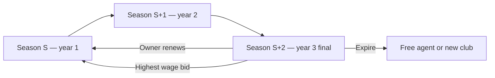

# GPSL Player contracts — specification (draft)

Authoritative design from league owner (2026). Align with legacy spreadsheet when reviewing.

**Status:** **Phases 1–3 (C1–C5 core)** — signing, same-season lock, final-year rules, Squad renew/expire, hidden wage bids + resolution on rollover. Uses **`competition_seasons.label`** for `Season_Signed`. SQL: `player_contract_hooks.sql`, `player_contracts_phase2.sql`, `player_contracts_phase3_expiry.sql`.

---

## Summary

| Topic | Rule |
|--------|------|
| **Length** | **3 GPSL seasons** per signing |
| **Decision window** | After **2 seasons played** (start of **final contract year**) |
| **Selling** | Allowed only while **2+ seasons remain** — **cannot sell** in final year |
| **Final year (1 left)** | Player **automatically** on expiring-contract / FA list — no transfer list |
| **Owner choices (final year, contested)** | Wage bid only — **no mid-season renew/expire**; FA+MV only at rollover if unsigned |
| **Expiry wage bid floor** | At least **+10%** above current contract wage (whole ₿; no fixed step) |
| **Home-grown** | `Players.Nation` = `Clubs.Nation` — **at least 8** (no maximum) |
| **Under-21** | Age **≤ 21** — **at least 5** (no maximum) |
| **Squad size** | **Max 28** players |
| **Uncontested renew** | **HG ≤23** or **non-HG ≤21** — same wage renew during season (no auction); if unsigned at rollover → FA + MV |
| **Expiry auction** | Everyone else in final year — one hidden bid per club; highest wins |
| **Winner wage** | Winning bid becomes player’s **contract wage** at new club (or stay) |
| **Free agent again** | Wage reverts to **standard calculated wage** (formula TBD from spreadsheet) |

---

## Contract lifecycle (timeline)

Assume player signs at start of **season S** (GPSL/transfer season counter, not necessarily `competition_seasons.id`).


```mermaid
flowchart LR
  S1[Season S — year 1]
  S2[Season S+1 — year 2]
  S3[Season S+2 — year 3 final]
  FA[Free agent or new club]

  S1 --> S2 --> S3
  S3 -->|Owner renews| S1
  S3 -->|Highest wage bid| S1
  S3 -->|Expire| FA
```

| Phase | Seasons left | Owner | Other clubs |
|--------|----------------|--------|-------------|
| Years 1–2 | 3 → 2 | Normal squad; **may sell** on transfer market (window rules) | — |
| **Final year** | **1** | **Auto-listed** on expiring-contract market; **no selling**; renew **or** expire | **One hidden wage bid** each (incl. current club) |
| Resolution | 0 | Renew → new 3-year deal; or expire → **MV** credit + FA | Highest wage bid wins player at bid wage |

**Uncontested brackets** (see below): HG≤23 or non-HG≤21 use uncontested renew/release; everyone else (incl. HG 24+) uses the contested wage auction.

**Open with spreadsheet:** whether “3 seasons” means three full rollovers after signing season, or signing season counts as year 1 inclusive (spec above uses **inclusive: years at S, S+1, S+2**).

---

## Uncontested renewal (exempt from wage auction)

When **1 season remains**, these brackets skip the contested expiry market (age/HG re-checked at decision time):

1. **Home-grown and age ≤ 23**
2. **Not home-grown and age ≤ 21**

| They skip | They still get |
|-----------|----------------|
| Automatic listing on expiring-contract / FA bid market | **Uncontested renewal** decision (owner only) |
| Hidden wage bids from **other** clubs | Choice: **renew** or **release for market value** |
| Competing against external highest wage | No other club can poach via expiry auction |

### Owner options (uncontested)

1. **Renew** during the season — new **3-season** deal at the **same wage**.
2. **No mid-season expire** — if not renewed, at **season rollover** they become a free agent and the holding club receives **market value**.

### Contested (everyone else)

Including **home-grown aged 24+** and **non-HG aged 22+**: auto-listed on Expiring Contracts; hidden wage bids; highest wins at season rollover. Unsigned (no winning bid) → FA + MV to holder at rollover.

**Exception — One of our Own:** if the player is the club’s current OooO and would otherwise be contested, they **skip the auction**. Owner may renew for a new **3-season** deal at **+2.5%** wage. Young OooO who already qualify for uncontested (HG ≤23) still renew at the **same wage**. Clearing OooO mid final year returns them to normal rules.

**Cannot sell** in the final contract year (all brackets) — sell only with **2+ seasons** left.

**Implementation:**

```text
is_homegrown(player, club) :=
  normalize(Players.Nation) = normalize(Clubs.Nation)

expiry_age_exempt(player, club) :=
  (is_homegrown AND age <= 23) OR (NOT is_homegrown AND age <= 21)

expiry_auction_exempt(player, club) :=
  expiry_age_exempt OR player is club one_of_our_own

expiry_auction_applies(player) :=
  final_year AND contracted AND NOT expiry_auction_exempt(player)

ooo_uplift_renew :=
  is OooO AND NOT expiry_age_exempt → renew wage = current × 1.025
```

- Club nation: `Clubs.Nation`
- Player nation: `Players.Nation`
- SQL: `is_player_expiry_age_exempt`, `is_player_expiry_auction_exempt`, `player_expiry_auction_applies`, `player_contract_renew`, `contract_ooo_renew_uplift_pct`
- JS: `squad_rules.js` → `isExpiryAgeExempt()`, `isExpiryAuctionExempt()`, `isOooOWageUpliftRenew()`

---

## Squad composition rules (28-man squad)

| Rule | Minimum |
|------|---------|
| **Home-grown** | **Minimum 8** (Nation matches `Clubs.Nation`; no maximum) |
| **Under-21** | **Minimum 5** (player `Age` **≤ 21**; no maximum) |
| **Squad size** | **Maximum 28** registered players |

- Compliance check: `check_club_squad_composition(club_short)` (SQL) / `analyseSquadComposition()` (JS).
- UI: **Squad** page shows counts and warnings (informational until registration enforced in transfers).

**Squad size (28):** signing is **not blocked** at 28; a **29th** signing is allowed and triggers auto-release of the **highest-rated** player who was **not signed this season** (foreign sale slot if available, else MV + free agent). UI confirms when already at 28.

**Overflow release consequences:**

| Method | Club receives | Fine | Released player |
|--------|---------------|------|-----------------|
| **Foreign overflow** (tracking slot available) | MV credit + ledger `transfer_foreign_sale` | **None** | Unavailable until next season — same as a normal foreign sale |
| **MV overflow** (no foreign slot) | MV credit + ledger `transfer_overflow_release` | **£10,000,000** per player (`gov_fine_compensation` / tariff `squad_overflow_mv_release`) | Contract paid up by releasing club — unavailable until next season (`foreign_contract_lock_kind = paid_up`) |

**Voluntary contract release (squad action):** up to **3 per club per season** (resets on season activate). Owner pays **contract wage × seasons remaining** (ledger `contract_release_comp`); no MV. Player becomes a free agent with the same paid-up season lock and GPDB message as MV overflow.

**Not yet enforced on signing:** minimum **8** home-grown and **5** under-21 (warnings on Squad only).

---

## Selling vs final year

| Seasons remaining | Transfer list / sell |
|-------------------|----------------------|
| **3 or 2** | **Allowed** (existing transfer window & listings) |
| **1** | **Blocked** — owner cannot list or sell; player is **automatically** on the expiring-contract market |

So a club that wanted to cash out must do it **before** the last contract season starts.

---

## Owner options (final contract year only — standard players)

Applies when `expiry_auction_applies` is true and **1 season remains** (not uncontested: HG≤23 or non-HG≤21).

### 1. Renew contract

- Owner offers a **new 3-season contract** (via winning their own hidden bid if others bid too).
- **Wage offered must be at least +10% above today** (whole ₿) — cannot renew on the same wage or a pay cut.
- Contract resets to **3 seasons remaining** at the chosen wage.

### 2. Contract ends unsigned (season rollover only)

- **No mid-season expire-for-MV** action.
- At rollover, if not re-signed (bid win or renew): player becomes **free agent**; holding club receives **market value**.

### 3. Sell — not available

- **No** transfer listing, direct sale, or outgoing transfer in the final contract season.
- Dispute resolution: engine must **reject** `Player_Transfer_Listings` and seller-initiated moves when `seasons_remaining = 1`.

---

## Hidden wage bids (1 season remaining)

At **1 season left**, contested players are **automatically** on the **expiring-contracts market** (no owner action required). **HG≤23 and non-HG≤21 are not listed there** (Squad renew/release only).

| Rule | Detail |
|------|--------|
| **Who can bid** | Any owner (including **current** club) |
| **Bids per club** | **One** wage offer per player per expiry cycle — **locked** once submitted (cannot change) |
| **Floor** | At least **+10%** above current contract wage |
| **Step** | Any whole ₿ amount at or above the floor |
| **Visibility** | **Hidden** — other owners do not see competing amounts |
| **Timing** | For contract **expiry** (end of final season), not immediate transfer |
| **Winner** | **Highest wage** at resolution |
| **Current club wins tie?** | **Yes** — equal highest wage → holding club retains |
| **Outcome** | Winner’s club gets player on **new 3-season contract** at **bid wage** |
| **No bids** | Player → draft free-agent list; wage resets to **calculated norm**; holding club credited **MV** |
| **Other club wins** | Pays **market value** compensation to holding club; player moves at rollover |
| **Champ ← SL** | If winner is Championship and holder is Super League: extra **15% of market value** signing-on fee **to the player** (separate from wage; debit buying club only) |

If **current owner** wins: player **stays**, wage updates to winning bid, contract **renews** (3 seasons).

If **other owner** wins: player moves at **season rollover** (admin **Start New Season**) with bid wage and **3 seasons** — not before. Winner pays MV to the selling club; Championship winners of SL players also pay the ₿10m Central Bank fee.

SQL patch: `supabase/sql/patches/contract_expiry_wage_rules_v2.sql` (also mirrored in `player_contracts_phase3_expiry.sql`).

---

## Wage model

| State | Wage source |
|--------|-------------|
| Under contract | **Stored contract wage** (`player_contracts.wage`) — may start from calculated wage at signing |
| Free agent | **Standard calculated wage** (see below) |
| After winning expiry bid | **Bid amount** becomes contract wage |

### Standard calculated wage (implemented settings)

```text
wage = round(market_value × division_wage_pct / 100)
```

| Club division (current competition season) | % source |
|---------------------------------------------|----------|
| **SuperLeague** | `global_settings.wage_pct_superleague` (default **5%**) |
| **Championship A or B** | `global_settings.wage_pct_championship` (default **4%**) |

- **Admin:** GPSL Admin → Transfer Management → **Wage % of market value** (requires `player_wage_settings.sql`).
- **SQL:** `calculate_standard_player_wage(mv, tier)`, `calculate_player_wage_for_club(player_id, club)`.
- **JS:** `wages.js` — `loadWagePercentages`, `wageFromMarketValue`.

Contract wage on the player record can differ after renewal / expiry bids; calculated wage is the **default** for FA and new signings unless overridden.

---

## Integration with existing systems

| System | Interaction |
|--------|-------------|
| **Draft / FA signings** | On assign to club → create **3-season contract**, set initial wage (calculated standard or draft rule?) |
| **Transfer purchase** | On assign to club (transfer, draft, expiry win) → **always fresh 3 seasons** |
| **`rollover_season`** | Decrement `seasons_remaining`; trigger decision window + FA listing; resolve bids at season boundary |
| **`competition_seasons`** | Display only; contract clock should follow **transfer season** unless spreadsheet says otherwise |
| **Transfer window** | Listings allowed only if **seasons_remaining ≥ 2**; at **1**, block list/sale and auto-add to expiry market |
| **Finances** | MV refund on expire; wages may affect future **weekly/monthly** costs? **→ spreadsheet** |

---

## Suggested data model (implementation sketch)

```text
player_contracts
  id
  player_id (Konami_ID)
  club_short_name
  seasons_total        -- 3
  seasons_remaining    -- 3..0
  wage                 -- numeric, per GPSL rules
  status               -- active | final_year | renewal_offered | expiring | expired | superseded
  signed_season_label  -- e.g. "2025/26" or integer from rollover
  created_at / updated_at

player_contract_wage_bids  (hidden expiry bids)
  id
  player_id
  contract_id
  bidder_club_short_name
  wage_offer
  created_at
  unique (contract_id, bidder_club_short_name)   -- one bid per club

player_contract_owner_actions
  renew_wage / expire / list_for_sale flags per contract year — or derive from status
```

Public views: `player_contracts_public` (owner sees own squad expiry), `expiring_contracts_market_public` (1 season left, no bid amounts of others).

RPCs (examples):

- `contract_create_on_signing(player_id, club, wage, seasons)`
- `contract_owner_renew(contract_id, wage)` — validate wage ≥ current
- `contract_owner_expire(contract_id)` — MV credit + FA
- `contract_submit_expiry_bid(contract_id, wage)` — one per club
- `contract_resolve_expiry(contract_id)` — on rollover or admin
- `contract_tick_season_rollover()` — called from or after `rollover_season`

---

## UI (target)

| Page | Purpose |
|------|---------|
| **Squad** | Seasons left, wage; final year: standard → renew (≥ wage) / expire / bids; HG → renew **at current** / release MV only |
| **Expiring contracts / FA market** | Players with 1 season left; submit hidden bid |
| **GPDB** | Badge: contract years, expiring soon |
| **Transfer Centre** | Incoming/outgoing expiry bid results |
| **Admin** | Force resolve, override, audit bids after close |

---

## Implementation phases (proposed)

1. **C1 — Schema + signing hook** — `player_contracts`, wage column, create on draft/transfer assign, display on squad.
2. **C2 — Rollover tick** — decrement seasons; mark `final_year`; MV expire; hook `rollover_season`.
3. **C3 — Owner renew / expire** — renew validation (wage ≥ current); expire → MV + FA + standard wage.
4. **C4 — Expiry market + hidden bids** — listing at 1 season left; one bid per club; blind UI.
5. **C5 — Resolution** — highest bid at season end; move player / renew; notifications.
6. **C6 — Standard wage formula** — port from spreadsheet; apply on all FA states.

---

## Plain language (owner Q&A)

**“Same 3-season clock and final-year timing?”**  
Every signed player gets a **3-year deal**. Year 3 is the **last year** — renew / expire / wage auction (for contested players) happens then. Same calendar for all; only the final-year path differs for uncontested brackets.

**“Renew exactly current wage vs ≥ current?”**  
- **Contested (everyone else):** wage auction / renew-now must be **at least** current wage.  
- **Uncontested (HG≤23 or non-HG≤21):** renew at **the same wage as now** (no auction).

**Resolved from owner (2026):**

| Question | Answer |
|----------|--------|
| HG sell in final year? | **No** — same as standard |
| HG age 24+ | **Contested** wage auction (no HG protection) |
| Non-HG ≤21 | **Uncontested** renew/release |

## Open questions (spreadsheet)

1. Exact **season counter**: `Season_Signed` + rollover count vs `competition_seasons.label`?
2. ~~Transfer mid-contract~~ — **confirmed:** always **3 seasons** on signing.
3. **Tie** on highest wage — **implemented:** current holding club wins (then earliest bid).
4. **When** are bids revealed — never, or after resolution?
5. **Expiry timing** — **confirmed:** player stays at current club during final year; bids resolve at **rollover** only; winner gets **3 seasons** then.
6. **MV refund** — ledger line / tax?
7. Enforce squad mins on **signing** only, or block **matchday** too?
8. Expiring list: separate tab vs mixed with FAs?

---

## Related repo state (today)

- `Players`: `Contracted_Team`, `market_value`, `Season_Signed`, `contract_seasons_remaining`, `contract_wage` — set on sign via `player_assign_to_club`; cleared via `player_release_from_club`.
- Transfers: `transferengine_*`, draft settlement — call `player_assign_to_club` (fresh 3-year contract each signing).
- **Same-season resale block** — `player_contract_hooks.sql` triggers.
- **Final year** — `assert_player_transferable` blocks list/sell at 1 season left; Squad RPCs `player_contract_renew` / `player_contract_expire`; `contract_tick_season_rollover` on admin season start.
- Admin **Season rollover** button calls `rollover_season` (not in repo SQL).
- Competition phases 0–6: **no** player contracts.

When reviewing the spreadsheet, map each tab/column to sections above and note any rule that differs.
